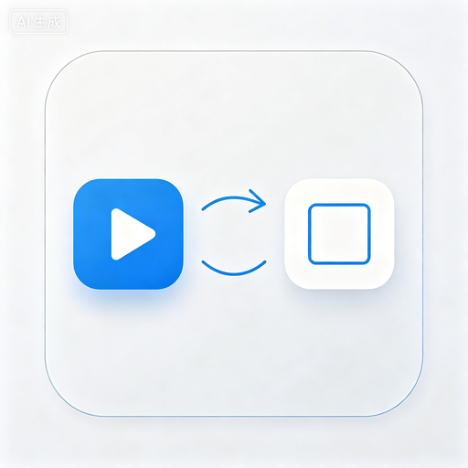

# iConvert - 格式转换器

  

  纯 Flutter 实现的 iOS Cupertino 风格媒体格式转换工具

  
  
  
  

## 📱 简介

iConvert 是一款采用纯 iOS 设计语言（Cupertino）的媒体格式转换工具，支持图片、视频、音频的批量转换。

## ✨ 功能

### 图片转换
- 支持 JPEG / PNG / WebP / HEIC / BMP / ICO 等格式
- 质量调节、分辨率设置、透明度保留

### 视频转换
- 支持 MP4 / MOV / AVI / WMV / MKV / FLV / MPEG / MPG / WebM / GIF
- 帧率设置、硬件编码优先

### 音频转换
- 支持 MP3 / AAC / WMA / OGG / FLAC / WAV / APE
- 采样率、量化位数、比特率、声道设置
- 3D 环绕音效
- 音频裁剪

### 其他功能
- 批量转换，后台队列执行
- 前台服务通知栏进度
- 历史记录管理
- 液态玻璃 UI（可选，iOS 控制中心风格）
- 新手教程
- 桌面快捷方式

## 📥 下载

前往 [Releases](https://github.com/Ming-QWQ520/iconvert/releases) 下载最新 APK：

| 文件 | 适用设备 | 大小 |
|------|---------|------|
| `app-arm64-v8a-release.apk` | 现代手机（推荐） | ~64 MB |
| `app-armeabi-v7a-release.apk` | 32 位旧设备 | ~98 MB |
| `app-x86_64-release.apk` | 模拟器 | ~72 MB |

## 🛠 技术栈

| 功能 | 库 |
|------|----|
| 框架 | Flutter 3.44.1 |
| 转换引擎 | FFmpeg (LGPL) |
| 状态管理 | Provider |
| 文件选择 | file_picker / image_picker |
| 音频播放 | just_audio |
| 视频播放 | video_player + chewie |
| 液态玻璃 | liquid_glass_easy |
| 前台服务 | flutter_foreground_task |

## 📄 开源协议

本项目基于 [AGPL-3.0](LICENSE) 协议开源。

## 👨‍💻 开发者

**明 (Ming)**

- GitHub: [@Ming-QWQ520](https://github.com/Ming-QWQ520)
- 仓库: [iConvert](https://github.com/Ming-QWQ520/iconvert)

## ⭐ Star

如果觉得项目好，欢迎给个 Star！
